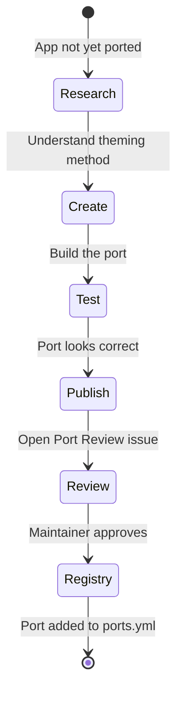

# Creating a Kape Port

> A step-by-step guide for porting Kape to a new application.

---

## What Is a Port?

A **port** is a Kape color theme adapted for a specific application. Each port lives in its own GitHub repository under the [`kape-theme`](https://github.com/kape-theme) organization, named after the app itself (all lowercase, no `kape-` prefix).

Examples:
- `kape-theme/nvim` — Neovim
- `kape-theme/ghostty` — Ghostty terminal
- `kape-theme/zed` — Zed editor

---

## Before You Start

1. **Check if it already exists** — look at [`resources/ports.yml`](../resources/ports.yml)
2. **Check open requests** — search the [Discussions](https://github.com/gabiuz/kape/discussions) for existing port requests
3. **Understand how the app is themed** — config file, JSON theme file, CSS injection, plugin, etc.

---

## Submission Workflow



---

## Step 1 — Set Up Your Repository

1. Create a new **public** repo under the [`kape-theme`](https://github.com/kape-theme) organization named `<appname>` (just the app name, lowercase, no `kape-` prefix)
2. Add a `LICENSE` file — use MIT
3. Add a `README.md` with:
   - What the app is
   - A screenshot of Kape applied to it
   - Installation instructions

---

## Step 2 — Reference `colors.json`

**Always source colors from [`colors.json`](../colors.json).** Never hardcode hex values from memory — the file is the single source of truth.

The file is structured as:
```
colors.json
  base.*         → background, surface, and text layers
  accents.*      → named semantic colors
  ansi.normal.*  → 16-color ANSI normal set
  ansi.bright.*  → 16-color ANSI bright set
  ui.*           → extended UI support colors (for richer ports)
```

Refer to [`docs/specs.md`](./specs.md) for the full color reference and [`docs/style-guide.md`](./style-guide.md) for which color maps to which UI element.

---

## Step 3 — Build the Port

Apply colors from `colors.json` following the [style guide](./style-guide.md).

### Common port types:

**Config file (terminal emulators like Ghostty, Kitty, Foot):**
- Map ANSI colors from `colors.json` → `ansi.normal.*` and `ansi.bright.*`
- Set background from `base.background`, foreground from `base.foreground`

**JSON theme file (Zed, VS Code):**
- Map syntax tokens following the [style guide](./style-guide.md)
- Use all color groups as needed

**Editor plugin (Neovim):**
- Use all groups including `ui.*` for full integration
- Follow the style guide for diagnostics and diff colors

---

## Step 4 — Test Your Port

Before submitting, verify:
- [ ] Colors look correct in actual use (screenshots)
- [ ] All hardcoded hex values trace back to `colors.json`
- [ ] The theme is readable — sufficient contrast for text
- [ ] Diagnostics (errors/warnings) are visually distinct
- [ ] Dark backgrounds are using `base.*` colors, not made-up values

---

## Step 5 — Submit for Review

Open a **Port Review** issue in this repository using the issue template.

You'll need to provide:
- A link to the port repository
- Screenshots of the theme applied
- Confirmation of the submission checklist

---

## Step 6 — Get Added to the Registry

Once approved, a maintainer will add your port to [`resources/ports.yml`](../resources/ports.yml). The GitHub Actions workflow will automatically regenerate the `README.md` port list on the next push.

---

## Naming Rules

| Thing | Rule |
|---|---|
| Repository name | `<appname>` — just the app name, lowercase, no spaces, no `kape-` prefix (e.g. `btop`, `nvim`, `ghostty`) |
| Organization | Always under [`kape-theme`](https://github.com/kape-theme) |
| Theme file name | `kape` or `kape-dark` where the app expects a name |
| Theme display name | `Kape` or `Kape Dark` (title case) |

---

## Licensing

All ports must be released under the **MIT license**. Copy the MIT license text and update the copyright year and author name. Do not use more restrictive licenses.

---

## Ongoing Maintenance

As a port maintainer, you're expected to:
- Keep the port up to date when the app updates its theming API
- Respond to issues and PRs in your port's repository
- Update colors if the Kape palette is revised (follow the changelog)

If you can no longer maintain a port, open an issue and we'll find a new maintainer or archive the port.
